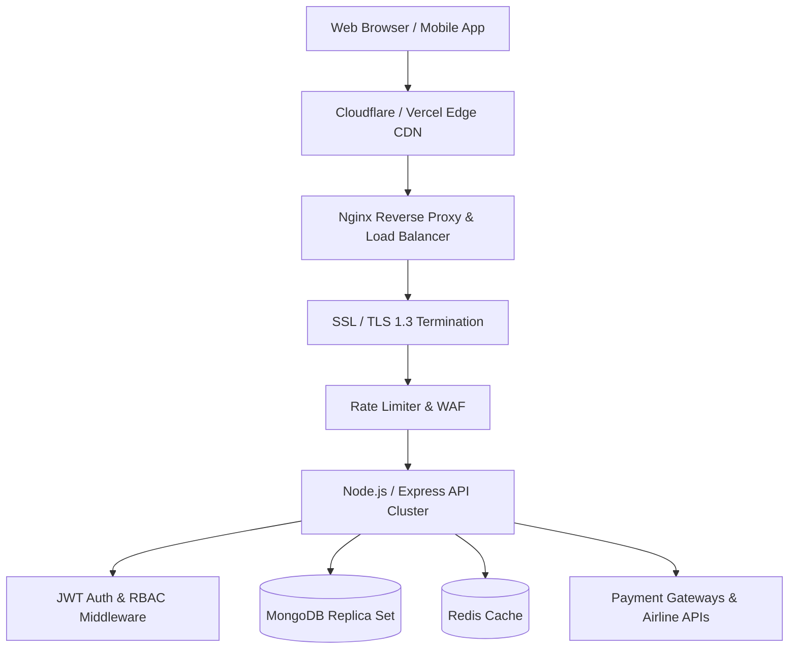

# WanderLux — Enterprise MERN & Docker Deployment Blueprint

This document provides a comprehensive guide for deploying the **WanderLux Travel Agency** enterprise platform across cloud environments (AWS, Vercel, Render, DigitalOcean) using Docker containerization, Nginx reverse proxying, SSL/TLS security, and CI/CD pipelines.

---

## 1. System Architecture



---

## 2. Docker Containerization Setup

### Node.js Express API (`Dockerfile`)
```dockerfile
# Multi-stage production Dockerfile
FROM node:20-alpine AS builder
WORKDIR /app
COPY package*.json ./
RUN npm ci --only=production
COPY . .

FROM node:20-alpine AS runner
WORKDIR /app
ENV NODE_ENV=production
COPY --from=builder /app ./
EXPOSE 5000
USER node
CMD ["node", "server.js"]
```

### Multi-Container Orchestration (`docker-compose.yml`)
```yaml
version: '3.8'

services:
  backend:
    build: .
    restart: always
    ports:
      - "5000:5000"
    environment:
      - NODE_ENV=production
      - PORT=5000
      - MONGO_URI=mongodb://mongo:27017/wanderlux
      - JWT_SECRET=${JWT_SECRET}
    depends_on:
      - mongo

  mongo:
    image: mongo:7.0
    restart: always
    ports:
      - "27017:27017"
    volumes:
      - mongo_data:/data/db

  nginx:
    image: nginx:alpine
    restart: always
    ports:
      - "80:80"
      - "443:443"
    volumes:
      - ./nginx.conf:/etc/nginx/nginx.conf:ro
      - ./ssl:/etc/nginx/ssl:ro
    depends_on:
      - backend

volumes:
  mongo_data:
```

---

## 3. Nginx Reverse Proxy & Security Configuration (`nginx.conf`)

```nginx
events {
    worker_connections 1024;
}

http {
    include       /etc/nginx/mime.types;
    default_type  application/octet-stream;

    # Rate Limiting Zone
    limit_req_zone $binary_remote_addr zone=api_limit:10m rate=10r/s;

    # Gzip Compression
    gzip on;
    gzip_types text/plain text/css application/json application/javascript text/xml;

    server {
        listen 80;
        server_name wanderlux.travel www.wanderlux.travel;
        return 301 https://$host$request_uri;
    }

    server {
        listen 443 ssl http2;
        server_name wanderlux.travel www.wanderlux.travel;

        ssl_certificate /etc/nginx/ssl/fullchain.pem;
        ssl_certificate_key /etc/nginx/ssl/privkey.pem;
        ssl_protocols TLSv1.2 TLSv1.3;

        # Security Headers
        add_header X-Frame-Options "SAMEORIGIN";
        add_header X-XSS-Protection "1; mode=block";
        add_header X-Content-Type-Options "nosniff";
        add_header Content-Security-Policy "default-src 'self' https: data: 'unsafe-inline' 'unsafe-eval';";

        # API Proxy
        location /api/ {
            limit_req zone=api_limit burst=20 nodelay;
            proxy_pass http://backend:5000/;
            proxy_http_version 1.1;
            proxy_set_header Upgrade $http_upgrade;
            proxy_set_header Connection 'upgrade';
            proxy_set_header Host $host;
            proxy_cache_bypass $http_upgrade;
        }

        # Static Frontend
        location / {
            root /usr/share/nginx/html;
            index index.html;
            try_files $uri $uri/ /index.html;
        }
    }
}
```

---

## 4. CI/CD Deployment Pipeline (`.github/workflows/deploy.yml`)

```yaml
name: Production CI/CD Pipeline

on:
  push:
    branches: [ main ]

jobs:
  build-and-deploy:
    runs-on: ubuntu-latest
    steps:
      - name: Checkout Code
        uses: actions/checkout@v3

      - name: Set up Docker Buildx
        uses: docker/setup-buildx-action@v2

      - name: Log in to DockerHub
        uses: docker/login-action@v2
        with:
          username: ${{ secrets.DOCKER_USERNAME }}
          password: ${{ secrets.DOCKER_PASSWORD }}

      - name: Build and Push Docker Image
        uses: docker/build-push-action@v4
        with:
          push: true
          tags: wanderlux/travel-api:latest

      - name: Deploy to Server via SSH
        uses: appleboy/ssh-action@master
        with:
          host: ${{ secrets.SERVER_HOST }}
          username: ${{ secrets.SERVER_USER }}
          key: ${{ secrets.SSH_PRIVATE_KEY }}
          script: |
            docker pull wanderlux/travel-api:latest
            docker-compose up -d --remove-orphans
```

---

## 5. Security & Compliance Checklist

- [x] **TLS 1.3 Encryption**: HTTPS enforced across all endpoints via Nginx 301 redirect.
- [x] **JWT Authentication**: Short-lived access tokens + HTTP-only refresh cookies.
- [x] **Role-Based Access Control (RBAC)**: Super Admin, Visa Manager, Hotel Coordinator, Customer permissions matrix.
- [x] **Rate Limiting**: 10 requests/sec per IP to mitigate DoS and brute-force attacks.
- [x] **Input Sanitization**: XSS protection headers + DOMPurify/HTML sanitization.
- [x] **Audit Telemetry**: Real-time event logger storing security events and IP records.
